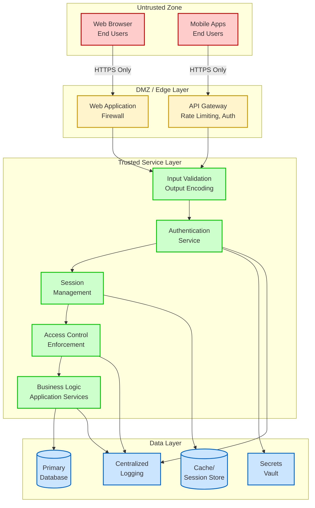

# System Security Requirements

Vibrant Emotional Health's system security requirements based on OWASP ASVS 5.0.

## About This Repository

This repository contains Vibrant's development of system security requirements. It is maintained by the InfoSec team.

## Requirements Index (ASVS 5.0)

| # | Chapter | Description |
| :---: | :--- | :--- |
| 1 | [Encoding and Sanitization](./1-encoding-sanitization.md) | Input validation, output encoding, injection prevention |
| 2 | [Validation and Business Logic](./2-validation-business-logic.md) | Business logic controls, data validation |
| 3 | [Web Frontend Security](./3-web-frontend-security.md) | Client-side security, DOM security |
| 4 | [API and Web Service](./4-api-web-service.md) | REST API security, web services |
| 5 | [File Handling](./5-file-handling.md) | File upload, storage, processing |
| 6 | [Authentication](./6-authentication.md) | Identity verification, credential management |
| 7 | [Session Management](./7-session-management.md) | Session lifecycle, token security |
| 8 | [Authorization](./8-authorization.md) | Access control, permissions |
| 9 | [Self-contained Tokens](./9-self-contained-tokens.md) | JWT, bearer tokens, MAC tokens |
| 10 | [OAuth and OIDC](./10-oauth-oidc.md) | Federation, identity providers |
| 11 | [Cryptography](./11-cryptography.md) | Encryption, key management |
| 12 | [Secure Communication](./12-secure-communication.md) | TLS, network security |
| 13 | [Configuration](./13-configuration.md) | Security configuration, deployment |
| 14 | [Data Protection](./14-data-protection.md) | PII, PHI, sensitive data |
| 15 | [Secure Coding and Architecture](./15-secure-coding-architecture.md) | Security architecture, SDLC |
| 16 | [Security Logging and Error Handling](./16-security-logging.md) | Audit logging, error handling |
| 17 | [WebRTC](./17-webrtc.md) | Real-time communication security |

## Understanding Requirement Levels

This repository uses a simplified two-level structure:

| Level | Description | When Required |
| :--- | :--- | :--- |
| **Baseline** | Essential security controls | All systems |
| **Enhanced** | Beyond basics for higher sensitivity | Systems handling sensitive data |

> **Note**: ASVS Level 3 (Advanced) is excluded due to organizational maturity. These requirements represent achievable near-future goals.

## Regulatory Context

These requirements align with:

- **HIPAA Security Rule** (45 CFR 164.302-318) - Technical safeguards for PHI
- **42 CFR Part 2** - Substance use disorder (SUD) record protections
- **NIST SP 800-53 Rev. 5** - Security control catalog (SC, AC, AU families)
- **NOFO FG-26-001** - 988 Lifeline grant requirements

Each requirement includes a regulatory column showing applicable controls.

## System Architecture

**Key Architectural Principles**:
- All security controls enforced in Trusted Service Layer
- Trust boundaries clearly defined at edge/DMZ
- Communications encrypted between zones
- Input validation occurs before processing
- All access logged for audit trails

## Usage

These requirements should match Vibrant's consensus on achievable state-of-the-art. If you see anything that doesn't pass the Vibrant smell test, please reach out!

## Origin

Requirements based on [OWASP Application Security Verification Standard (ASVS) 5.0](https://owasp.org/www-project-application-security-verification-standard/), released May 2025.

ASVS was chosen because:
- Maps directly to NIST guidelines
- Offers tiered requirements for maturity variation
- Represents consensus best practice in application security