# SaaS Data Pipeline Security Guide

## Overview

This guide applies ASVS requirements to data integration workflows composed of SaaS solutions. The **Sage Intacct → Fivetran → Snowflake → DBT Labs → Files.com** workflow is a hypothetical teaching example designed to help readers understand how to apply ASVS requirements to real-world SaaS integrations.

### Purpose

- Learn to analyze SaaS connectors against ASVS requirements
- Practice designing compensating controls when direct compliance is not possible
- Apply the gap analysis methodology to your own SaaS integrations

This is not an implementation manual for a specific production system, but rather a pattern you can apply to any SaaS integration evaluation.

## Architecture

```mermaid
%%{init: {'theme':'default', 'themeVariables': {'fontSize':'16px'}}}%%
graph LR
    %% Accessibility attributes
    accTitle: "SaaS Data Pipeline Security Architecture"
    accDescr: "Five-stage data pipeline architecture for PHI data flow: Sage Intacct (Source) with API authentication and MFA, Fivetran (ETL Pipeline) with column hashing and data minimization, Snowflake (Warehouse) with RBAC and dynamic masking, DBT Labs (Transformation) with environment isolation and SSO, and Files.com (Distribution) with PGP encryption and path-scoped permissions. All connections use TLS 1.2+ encryption."

    subgraph "Source"
        Intacct[📊 Sage Intacct<br/>Financial Data Source]
    end

    subgraph "Pipeline"
        Fivetran[🔄 Fivetran<br/>ETL Pipeline]
    end

    subgraph "Warehouse"
        Snowflake[❄️ Snowflake<br/>Data Warehouse]
    end

    subgraph "Transformation"
        DBT[⚙️ DBT Labs<br/>Data Transformation]
    end

    subgraph "Distribution"
        Files[📁 Files.com<br/>Secure Distribution]
    end

    Intacct -->|🔒 TLS 1.2+<br/>Web Services Auth<br/>⚠️ MFA Not Available| Fivetran
    Fivetran -->|🔒 TLS 1.2+<br/>Column Hashing| Snowflake
    Snowflake -->|🔒 TLS 1.2+<br/>RBAC| DBT
    DBT -->|🔒 TLS 1.2+<br/>PGP Encryption| Files

    %% High-contrast linkStyles for WCAG compliance
    linkStyle 0 stroke:#333333,stroke-width:2px
    linkStyle 1 stroke:#333333,stroke-width:2px
    linkStyle 2 stroke:#333333,stroke-width:2px
    linkStyle 3 stroke:#333333,stroke-width:2px

    %% Standardized color palette with accessibility compliance
    classDef source fill:#e3f2fd,stroke:#1565c0,stroke-width:2px,color:#0d47a1
    classDef pipeline fill:#fff3cd,stroke:#856404,stroke-width:2px,color:#212529
    classDef warehouse fill:#e8f5e8,stroke:#2e7d32,stroke-width:2px,color:#1b5e20
    classDef transform fill:#f3e5f5,stroke:#7b1fa2,stroke-width:2px,color:#4a148c
    classDef distribute fill:#ffe5e5,stroke:#c62828,stroke-width:2px,color:#b71c1c

    class Intacct source
    class Fivetran pipeline
    class Snowflake warehouse
    class DBT transform
    class Files distribute
```

> **ASVS Analysis Note**: The connection to Sage Intacct uses Web Services authentication, which does not support MFA. This triggers the compensating controls pattern documented in Stage 1.

### ASVS Mapping by Stage

| Stage | ASVS Requirements | Security Focus |
| :--- | :--- | :--- |
| **Source (Sage Intacct)** | V4.1, V6.3, V11.1 | API authentication, MFA, encryption in transit |
| **Pipeline (Fivetran)** | V4.2, V14.2, V16.1 | Data minimization, column hashing, audit logging |
| **Warehouse (Snowflake)** | V6, V8, V11.1, V14.1 | RBAC, dynamic masking, customer-managed keys |
| **Transformation (DBT Labs)** | V4, V6.3, V8.1, V16.1 | SSO, environment isolation, project-level permissions |
| **Distribution (Files.com)** | V4.1, V6.3, V8.4, V14.3 | PGP encryption, path-scoped permissions, emergency access |

## Using This Example for Your SaaS Evaluations

This guide uses Sage Intacct → Fivetran as a concrete example, but the pattern applies to any SaaS integration:

### Step 1: Research the Authentication Model

| Question | Source | What to Document |
| :--- | :--- | :--- |
| What authentication protocol? | Vendor API docs | OAuth 2.0, API keys, session-based, etc. |
| Can MFA be enforced? | Security whitepaper | Platform limitations, available factors |
| How are credentials stored? | Architecture docs | Your key management responsibilities |
| What audit logs are available? | Logging documentation | Log types, retention, SIEM integration |

### Step 2: Map to ASVS Requirements

For each ASVS chapter, determine:
- **Full applicability**: Requirement can be implemented as written
- **Partial applicability**: Requirement needs modification
- **Not applicable**: Platform limitation requires compensating control

### Step 3: Design Compensating Controls

When requirements cannot be directly implemented:

1. **Identify the risk** the ASVS requirement addresses
2. **Find alternative controls** that mitigate the same risk
3. **Map to other ASVS requirements** where possible
4. **Document in risk register** with business justification
5. **Schedule review** (quarterly/annually)

### Example: Mapping Compensating Controls

| ASVS Requirement | Risk Addressed | Your SaaS Limitation | Compensating Control | Mapped To |
| :--- | :--- | :--- | :--- | :--- |
| V6.3.1 (MFA) | Stolen credentials | No MFA for API users | IP restrictions + dedicated account | V12.1 (boundaries), V8.1 (least privilege) |
| V7.1 (session mgmt) | Session hijacking | No session timeout config | Network monitoring + alerts | V16.1 (audit logging) |
| V11.1 (TLS) | Eavesdropping | Older TLS version required | VPN/private networking | V12.3 (secure transport) |

### Step 4: Document for Compliance

Each SaaS integration should have:
- ASVS gap analysis worksheet
- Compensating controls design document
- Risk register entry for exceptions
- Quarterly review calendar invite

## Stage 1: Source System (Sage Intacct)

### Scenario

A healthcare organization needs to sync financial data from Sage Intacct to their data warehouse via Fivetran. This example illustrates how to apply ASVS requirements when the SaaS platform has authentication limitations.

### ASVS Gap Analysis

| ASVS Requirement | Direct Applicability | Analysis |
| :--- | :--- | :--- |
| V4.1.1 (API auth required) | Full | Web Services auth requires Sender ID + Company credentials |
| V6.3.1 (MFA offered) | Not Possible | Sage Intacct disables MFA for Web Services users by design |
| V6.3.2 (MFA for privileged) | Not Possible | Web Services users are programmatic; no UI access |
| V11.1.1 (TLS 1.2+) | Full | All connections use TLS 1.2 or higher |

### Decision: Compensating Controls for V6.3

Since MFA cannot be enforced on the API authentication itself, implement compensating controls:

| Missing Control | Compensating Control | ASVS Justification |
| :--- | :--- | :--- |
| V6.3.1 (MFA) | Network-level IP restrictions to Fivetran egress IPs | V12.1 (secure communication boundaries) |
| V6.3.2 (privileged MFA) | Dedicated Web Services user with quarterly review | V8.1.1 (least privilege), V6.2.1 (credential rotation) |
| Session security | Session token logging with timeout monitoring | V7.1.1 (session management) |

### Example Implementation

**Step 1: Verify Platform Capabilities**

Research the Fivetran Sage Intacct connector authentication model:
- Requires Web Services developer license (Sender ID + Password)
- Web Services users cannot use MFA (platform limitation)
- Uses session-based authentication via `getAPISession`

**Step 2: Configure Compensating Controls**

1. **Sign BAA** with Sage Intacct for PHI handling
2. **Obtain Web Services developer license** from Sage Intacct
3. **Verify "Needs Login for API" setting** is disabled (contact Sage Intacct Support)
4. **Authorize Sender ID** at company level (Company > Setup > Security)
5. **Create dedicated Web Services user** (API-only, no UI access)
6. **Apply compensating controls for missing MFA:**
   - Configure IP restrictions to Fivetran egress IPs only
   - Enable Web Services-specific audit logging (separate from UI logs)
   - Document quarterly review process for Web Services user access
   - Add exception to risk register with business justification

### Verification Checklist

- [ ] Web Services authentication model documented with ASVS gap analysis
- [ ] Compensating controls mapped to alternative ASVS requirements
- [ ] Risk register exception approved for non-MFA API authentication
- [ ] Quarterly review process established for Web Services user
- [ ] Web Services audit logs integrated with SIEM (separate from UI logs)
- [ ] "Needs Login for API" setting verified as "No"

### Key Takeaway for Readers

When evaluating SaaS connectors:
1. Research the actual authentication mechanism (do not assume standard API keys)
2. Document gaps between ASVS requirements and platform capabilities
3. Design compensating controls that address the same risk (unauthorized access)
4. Map compensating controls to alternative ASVS requirements
5. Document exceptions in risk register with business justification

## Stage 2: Pipeline (Fivetran)

### ASVS Requirements

- **V4.2.2**: Input validation on all endpoints
- **V14.2.1**: Data minimization
- **V14.2.3**: Retention policies
- **V16.1**: Audit logging

### Implementation

1. **Sign BAA** with Fivetran (Business Critical plan)
2. **Configure column blocking** for unnecessary PHI fields
3. **Enable column hashing** for fields needed for joins but not values
4. **Set up SSH tunnel** or AWS PrivateLink (avoid public internet)
5. **Configure data retention** (purge after sync completion)
6. **Enable audit logs** for connector configuration changes

### Verification

- [ ] Only required columns sync to destination
- [ ] Sensitive fields hashed where possible
- [ ] No data persists in Fivetran after sync
- [ ] All configuration changes logged

## Stage 3: Warehouse (Snowflake)

### ASVS Requirements

- **V6.3.2**: MFA required for privileged accounts
- **V8.1**: RBAC with least privilege
- **V14.1**: Data classification
- **V14.3**: Privacy controls (masking)
- **V11.1.2**: Encryption at rest with CMK

### Implementation

1. **Sign BAA** with Snowflake (Business Critical Edition)
2. **Enable Tri-Secret Secure** (customer-managed keys)
3. **Configure MFA** for all users (enforced at account level)
4. **Implement RBAC**:
   - `ACCOUNTADMIN` → limited to 2 people
   - `SECURITYADMIN` → security team only
   - `SYSADMIN` → DBAs
   - `DATA_LOADER` → Fivetran service account only
   - `DBT_SERVICE` → dbt Cloud service account (limited to specific databases)
   - `ANALYST` → read-only with masking
5. **Create dynamic masking policies** for PHI fields
6. **Set up row-level security** for multi-tenant data
7. **Configure audit log export** to S3 for 6-year retention

### Verification

- [ ] Login fails without MFA
- [ ] Users see only permitted data (RLS test)
- [ ] PHI fields masked for ANALYST role
- [ ] CMK rotation successful
- [ ] Audit logs exported within 24 hours

## Stage 4: Transformation (DBT Labs)

### ASVS Requirements

- **V4.1.1**: API authentication required
- **V6.3.1**: MFA offered to all users
- **V6.3.2**: MFA required for privileged accounts
- **V8.1**: RBAC with least privilege
- **V16.1**: Audit logging

### Implementation

1. **Sign BAA** with DBT Labs (under NDA for HIPAA report)
2. **Configure SAML SSO** (Okta, Azure AD, or Google Workspace)
3. **Enable SSO enforcement** for all non-admin users
4. **Implement RBAC**:
   - **Owner** → Full account admin (2 people max)
   - **Security Admin** → Security team (IT license)
   - **Developer** → Analytics engineers (per-project access)
   - **Read-Only** → Business users (specific projects only)
5. **Configure SCIM** for automated user provisioning/deprovisioning
6. **Set up environment isolation**:
   - `production` → restricted access, requires approval
   - `staging` → broader access, masked data
   - `development` → no PHI, synthetic data only
7. **Enable audit logging** for all model executions and deployments

### Verification

- [ ] SSO login works, local login disabled for non-admins
- [ ] Users can only access assigned projects
- [ ] Production environment requires approval workflow
- [ ] SCIM provisioning/deprovisioning works within 24 hours
- [ ] Audit logs capture all transformations

## Stage 5: Distribution (Files.com)

### ASVS Requirements

- **V4.1.1**: API authentication required
- **V6.3.1**: MFA offered to all users
- **V6.3.2**: MFA required for privileged accounts
- **V8.4**: Emergency access procedures
- **V14.3.1**: Consent management (42 CFR Part 2)
- **V14.3.4**: Accounting of disclosures

### Implementation

1. **Sign BAA** with Files.com for PHI handling
2. **Configure 2FA enforcement** for all users
3. **Set up SSO** (Okta, Azure AD, Google Workspace, or LDAP)
4. **Implement RBAC with path-scoped permissions**:
   - `/sensitive/` → restricted to security team
   - `/reports/` → read-only for analysts
   - `/shared/` → time-limited sharing only
5. **Enable PGP/GPG encryption** for files containing PHI
6. **Configure IP allowlisting** and geo-restrictions
7. **Set up immutable audit logs** (7+ year retention in WORM format)
8. **Enable file integrity checks** (SHA-256 hashes)
9. **Configure automatic expiration** for shared links (max 7 days)
10. **Document emergency access procedures** for crisis situations

### Verification

- [ ] 2FA enforced for all users
- [ ] SSO login functional, password login disabled
- [ ] Path permissions enforced (test access to restricted folders)
- [ ] PGP encryption applied to PHI files
- [ ] Audit logs immutable and queryable
- [ ] Shared links auto-expire
- [ ] Emergency access procedures tested annually

## Cross-Cutting Controls

### Example: V6.3 Authentication Exception Process

When a SaaS connector cannot meet ASVS V6.3 (MFA) requirements:

1. **Document the limitation**: "Sage Intacct Web Services users cannot use MFA (platform design)"
2. **Identify the risk**: "Stolen Web Services credentials allow unauthorized API access"
3. **Design compensating controls**:
   - Network-level IP restrictions (V12.1)
   - Dedicated service account (V8.1.1)
   - Enhanced audit logging (V16.1)
4. **Map to risk register**: Exception #1234, reviewed quarterly
5. **Schedule review**: Calendar invite for quarterly access review

**Key Principle**: The goal is risk mitigation, not checkbox compliance. Compensating controls are valid when they address the same risk through different mechanisms.

### V12: Secure Communication

- All connections use TLS 1.2+ (TLS 1.3 where supported)
- Private networking used where available (AWS PrivateLink, Private Service Connect)
- No unencrypted data in transit
- Certificate validation enforced

### V16: Security Logging

- Centralized logging across all five stages
- Log retention: 6 years (HIPAA requirement)
- Real-time alerting on anomalous access
- SIEM integration (Splunk, Datadog via webhooks)

### V14.4: 42 CFR Part 2 Specific

- SUD records marked in Snowflake (tagging)
- Disclosure logging to all recipients (Fivetran, DBT Labs, Files.com)
- Re-disclosure prohibition notices included
- Consent tracking for all Part 2 data

## Compliance Mapping

| Regulation | Requirements | Implementation |
| :--- | :--- | :--- |
| HIPAA 164.312 | Technical safeguards | Encryption, access controls, audit logs across all stages |
| 42 CFR Part 2 | SUD protections | Consent, marking, disclosure logging, re-disclosure notices |
| NOFO SC-15 | 988 data protection | Enhanced logging, emergency procedures, break-glass access |
| SOC 2 | Security controls | Vendor certifications, monitoring, change management |

## Risk Considerations

### High Risk

- **Data residency**: Fivetran and DBT Labs may process in multiple regions
- **Transformation exposure**: DBT Labs has access to raw data during transformation
- **File distribution**: Files.com is the final egress point—highest exposure risk
- **Key management**: Multiple CMK systems (Snowflake, Files.com PGP) add complexity

### Mitigation

- Configure Fivetran and DBT Labs for US-only processing
- Implement environment isolation in DBT (production requires approval)
- Enable PGP encryption for all Files.com distributions containing PHI
- Documented key rotation procedures with HSM backup
- Quarterly access reviews for all five stages
- Annual penetration testing of the complete pipeline

## Sources and Further Reading

This example uses the Fivetran Sage Intacct connector to illustrate ASVS application patterns. When evaluating your own SaaS integrations, consult:

### Vendor Documentation (Example)

- [Fivetran Sage Intacct Setup Guide](https://fivetran.com/docs/connectors/applications/sage-intacct/setup-guide)
- [Fivetran Sage Intacct API Configuration](https://fivetran.com/docs/connectors/applications/sage-intacct/api-configuration)

### General ASVS Application Resources

- [OWASP ASVS 5.0](https://asvs.dev/)
- [ASVS SaaS Supplementary Guidance](https://owasp.org/www-project-application-security-verification-standard/)

**Research Tip**: When evaluating a new connector, search for: "[vendor] [connector] authentication", "[vendor] security whitepaper", and "[vendor] API documentation" to find the specific security characteristics.
