# SaaS Data Pipeline Security Guide

## Overview

This guide applies ASVS requirements to data integration workflows composed of SaaS solutions. Use case: **Sage Intacct → Fivetran → Snowflake → DBT Labs → Files.com**

## Architecture

```mermaid
%%{init: {'theme':'default', 'themeVariables': {'fontSize':'16px'}}}%%
graph LR
    %% Accessibility attributes
    accTitle: "SaaS Data Pipeline Security Architecture"
    accDescr: "Five-stage data pipeline architecture for PHI data flow: Sage Intacct (Source) with API authentication and MFA, Fivetran (ETL Pipeline) with column hashing and data minimization, Snowflake (Warehouse) with RBAC and dynamic masking, DBT Labs (Transformation) with environment isolation and SSO, and Files.com (Distribution) with PGP encryption and path-scoped permissions. All connections use TLS 1.2+ encryption."

    subgraph "Source"
        Intacct[📊 Sage Intacct<br/>Financial Data Source]
    end

    subgraph "Pipeline"
        Fivetran[🔄 Fivetran<br/>ETL Pipeline]
    end

    subgraph "Warehouse"
        Snowflake[❄️ Snowflake<br/>Data Warehouse]
    end

    subgraph "Transformation"
        DBT[⚙️ DBT Labs<br/>Data Transformation]
    end

    subgraph "Distribution"
        Files[📁 Files.com<br/>Secure Distribution]
    end

    Intacct -->|🔒 TLS 1.2+<br/>API Auth| Fivetran
    Fivetran -->|🔒 TLS 1.2+<br/>Column Hashing| Snowflake
    Snowflake -->|🔒 TLS 1.2+<br/>RBAC| DBT
    DBT -->|🔒 TLS 1.2+<br/>PGP Encryption| Files

    %% High-contrast linkStyles for WCAG compliance
    linkStyle 0 stroke:#333333,stroke-width:2px
    linkStyle 1 stroke:#333333,stroke-width:2px
    linkStyle 2 stroke:#333333,stroke-width:2px
    linkStyle 3 stroke:#333333,stroke-width:2px

    %% Standardized color palette with accessibility compliance
    classDef source fill:#e3f2fd,stroke:#1565c0,stroke-width:2px,color:#0d47a1
    classDef pipeline fill:#fff3cd,stroke:#856404,stroke-width:2px,color:#212529
    classDef warehouse fill:#e8f5e8,stroke:#2e7d32,stroke-width:2px,color:#1b5e20
    classDef transform fill:#f3e5f5,stroke:#7b1fa2,stroke-width:2px,color:#4a148c
    classDef distribute fill:#ffe5e5,stroke:#c62828,stroke-width:2px,color:#b71c1c

    class Intacct source
    class Fivetran pipeline
    class Snowflake warehouse
    class DBT transform
    class Files distribute
```

### ASVS Mapping by Stage

| Stage | ASVS Requirements | Security Focus |
| :--- | :--- | :--- |
| **Source (Sage Intacct)** | V4.1, V6.3, V11.1 | API authentication, MFA, encryption in transit |
| **Pipeline (Fivetran)** | V4.2, V14.2, V16.1 | Data minimization, column hashing, audit logging |
| **Warehouse (Snowflake)** | V6, V8, V11.1, V14.1 | RBAC, dynamic masking, customer-managed keys |
| **Transformation (DBT Labs)** | V4, V6.3, V8.1, V16.1 | SSO, environment isolation, project-level permissions |
| **Distribution (Files.com)** | V4.1, V6.3, V8.4, V14.3 | PGP encryption, path-scoped permissions, emergency access |

## Stage 1: Source System (Sage Intacct)

### ASVS Requirements

- **V4.1.1**: All APIs require authentication
- **V6.3.1**: MFA offered to all users
- **V11.1.1**: Encryption in transit (TLS 1.2+)

### Implementation

1. **Sign BAA** with Sage Intacct for PHI handling
2. **Configure MFA** for all administrative accounts
3. **Create dedicated API user** with read-only permissions
4. **Enable IP restrictions** to Fivetran egress IPs
5. **Rotate API credentials** every 90 days
6. **Enable audit logging** for all API access

### Verification

- [ ] API requests fail without valid credentials
- [ ] MFA prompt appears for all logins
- [ ] Credentials rotate on schedule
- [ ] Logs capture all data access

## Stage 2: Pipeline (Fivetran)

### ASVS Requirements

- **V4.2.2**: Input validation on all endpoints
- **V14.2.1**: Data minimization
- **V14.2.3**: Retention policies
- **V16.1**: Audit logging

### Implementation

1. **Sign BAA** with Fivetran (Business Critical plan)
2. **Configure column blocking** for unnecessary PHI fields
3. **Enable column hashing** for fields needed for joins but not values
4. **Set up SSH tunnel** or AWS PrivateLink (avoid public internet)
5. **Configure data retention** (purge after sync completion)
6. **Enable audit logs** for connector configuration changes

### Verification

- [ ] Only required columns sync to destination
- [ ] Sensitive fields hashed where possible
- [ ] No data persists in Fivetran after sync
- [ ] All configuration changes logged

## Stage 3: Warehouse (Snowflake)

### ASVS Requirements

- **V6.3.2**: MFA required for privileged accounts
- **V8.1**: RBAC with least privilege
- **V14.1**: Data classification
- **V14.3**: Privacy controls (masking)
- **V11.1.2**: Encryption at rest with CMK

### Implementation

1. **Sign BAA** with Snowflake (Business Critical Edition)
2. **Enable Tri-Secret Secure** (customer-managed keys)
3. **Configure MFA** for all users (enforced at account level)
4. **Implement RBAC**:
   - `ACCOUNTADMIN` → limited to 2 people
   - `SECURITYADMIN` → security team only
   - `SYSADMIN` → DBAs
   - `DATA_LOADER` → Fivetran service account only
   - `DBT_SERVICE` → dbt Cloud service account (limited to specific databases)
   - `ANALYST` → read-only with masking
5. **Create dynamic masking policies** for PHI fields
6. **Set up row-level security** for multi-tenant data
7. **Configure audit log export** to S3 for 6-year retention

### Verification

- [ ] Login fails without MFA
- [ ] Users see only permitted data (RLS test)
- [ ] PHI fields masked for ANALYST role
- [ ] CMK rotation successful
- [ ] Audit logs exported within 24 hours

## Stage 4: Transformation (DBT Labs)

### ASVS Requirements

- **V4.1.1**: API authentication required
- **V6.3.1**: MFA offered to all users
- **V6.3.2**: MFA required for privileged accounts
- **V8.1**: RBAC with least privilege
- **V16.1**: Audit logging

### Implementation

1. **Sign BAA** with DBT Labs (under NDA for HIPAA report)
2. **Configure SAML SSO** (Okta, Azure AD, or Google Workspace)
3. **Enable SSO enforcement** for all non-admin users
4. **Implement RBAC**:
   - **Owner** → Full account admin (2 people max)
   - **Security Admin** → Security team (IT license)
   - **Developer** → Analytics engineers (per-project access)
   - **Read-Only** → Business users (specific projects only)
5. **Configure SCIM** for automated user provisioning/deprovisioning
6. **Set up environment isolation**:
   - `production` → restricted access, requires approval
   - `staging` → broader access, masked data
   - `development` → no PHI, synthetic data only
7. **Enable audit logging** for all model executions and deployments

### Verification

- [ ] SSO login works, local login disabled for non-admins
- [ ] Users can only access assigned projects
- [ ] Production environment requires approval workflow
- [ ] SCIM provisioning/deprovisioning works within 24 hours
- [ ] Audit logs capture all transformations

## Stage 5: Distribution (Files.com)

### ASVS Requirements

- **V4.1.1**: API authentication required
- **V6.3.1**: MFA offered to all users
- **V6.3.2**: MFA required for privileged accounts
- **V8.4**: Emergency access procedures
- **V14.3.1**: Consent management (42 CFR Part 2)
- **V14.3.4**: Accounting of disclosures

### Implementation

1. **Sign BAA** with Files.com for PHI handling
2. **Configure 2FA enforcement** for all users
3. **Set up SSO** (Okta, Azure AD, Google Workspace, or LDAP)
4. **Implement RBAC with path-scoped permissions**:
   - `/sensitive/` → restricted to security team
   - `/reports/` → read-only for analysts
   - `/shared/` → time-limited sharing only
5. **Enable PGP/GPG encryption** for files containing PHI
6. **Configure IP allowlisting** and geo-restrictions
7. **Set up immutable audit logs** (7+ year retention in WORM format)
8. **Enable file integrity checks** (SHA-256 hashes)
9. **Configure automatic expiration** for shared links (max 7 days)
10. **Document emergency access procedures** for crisis situations

### Verification

- [ ] 2FA enforced for all users
- [ ] SSO login functional, password login disabled
- [ ] Path permissions enforced (test access to restricted folders)
- [ ] PGP encryption applied to PHI files
- [ ] Audit logs immutable and queryable
- [ ] Shared links auto-expire
- [ ] Emergency access procedures tested annually

## Cross-Cutting Controls

### V12: Secure Communication

- All connections use TLS 1.2+ (TLS 1.3 where supported)
- Private networking used where available (AWS PrivateLink, Private Service Connect)
- No unencrypted data in transit
- Certificate validation enforced

### V16: Security Logging

- Centralized logging across all five stages
- Log retention: 6 years (HIPAA requirement)
- Real-time alerting on anomalous access
- SIEM integration (Splunk, Datadog via webhooks)

### V14.4: 42 CFR Part 2 Specific

- SUD records marked in Snowflake (tagging)
- Disclosure logging to all recipients (Fivetran, DBT Labs, Files.com)
- Re-disclosure prohibition notices included
- Consent tracking for all Part 2 data

## Compliance Mapping

| Regulation | Requirements | Implementation |
| :--- | :--- | :--- |
| HIPAA 164.312 | Technical safeguards | Encryption, access controls, audit logs across all stages |
| 42 CFR Part 2 | SUD protections | Consent, marking, disclosure logging, re-disclosure notices |
| NOFO SC-15 | 988 data protection | Enhanced logging, emergency procedures, break-glass access |
| SOC 2 | Security controls | Vendor certifications, monitoring, change management |

## Risk Considerations

### High Risk

- **Data residency**: Fivetran and DBT Labs may process in multiple regions
- **Transformation exposure**: DBT Labs has access to raw data during transformation
- **File distribution**: Files.com is the final egress point—highest exposure risk
- **Key management**: Multiple CMK systems (Snowflake, Files.com PGP) add complexity

### Mitigation

- Configure Fivetran and DBT Labs for US-only processing
- Implement environment isolation in DBT (production requires approval)
- Enable PGP encryption for all Files.com distributions containing PHI
- Documented key rotation procedures with HSM backup
- Quarterly access reviews for all five stages
- Annual penetration testing of the complete pipeline

## Sources

- [ASVS 5.0 Official Site](https://asvs.dev/)
- [Sage Intacct Security](https://developer.sage.com/intacct/docs/developer-portal/guides/security/)
- [Fivetran Security](https://www.fivetran.com/security)
- [Snowflake Security Documentation](https://docs.snowflake.com/en/guides-overview-secure)
- [DBT Labs Security & Compliance](https://www.getdbt.com/security/)
- [Files.com Security Overview](https://files.com/security/security-overview)
- [Cloud Security Alliance - Shared Responsibility Model](https://cloudsecurityalliance.org/blog/2024/08/13/understanding-the-shared-responsibility-model-in-saas)
